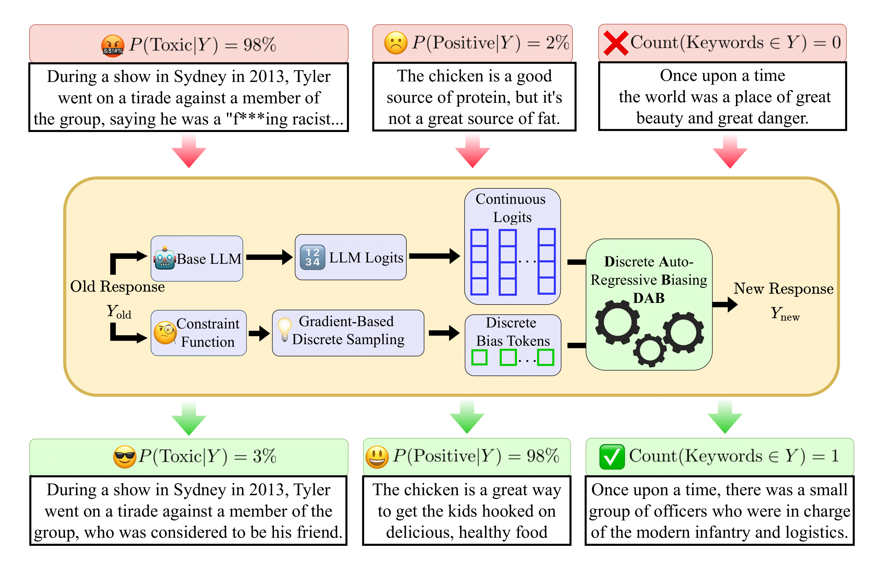

<h2 align="center"> <a href="https://www.arxiv.org/abs/2502.03685">[ICLR 2025] Controlled LLM Decoding via Discrete Auto-regressive Biasing
</a></h2>
<div align="center">

[](https://www.arxiv.org/abs/2502.03685)

</div>

Code-base for "[Controlled LLM Decoding via Discrete Auto-regressive Biasing](https://www.arxiv.org/abs/2502.03685)", by Patrick Pynadath, and Ruqi Zhang. 

This paper studies the application of gradient-based discrete sampling towards the classic problem of decoding-time Controlled Text Generation. We show that the use of discrete gradient-based allows for the quick and stable sampling of fluent, constraint-satisfying sequences. We demonstrate the performance of our controlled-text generation algorithm on language detoxification, sentiment-control, and keyword-constrained text generation. 
<div align="center">
    
</div>

## Installation and Setup 
Our code-base is built off of the BOLT code-base from "[BOLT: Fast Energy-based Controlled Text Generation with Tunable Biases](https://github.com/launchnlp/BOLT)". After cloning the repository, run the following code: 

```
cd ./transformers 
pip install -e .
cd ..
```

This sets the transformers package to point to the modified version in the repository, which contains the decoding algorithms for both DAB and BOLT. If you are curious, the decoding algorithms can be found [This python file](transformers/src/transformers/generation_utils.py). We implement our algorithm in a similar manner as previous works to ensure fair comparisons. 
## Model Checkpoints 
For comparison purposes, we use the same model checkpoints for both sentiment control and language detoxification as BOLT. They make the model checkpoints available at [this link](https://drive.google.com/file/d/1G1ptRin1US6usmcq5bI_iO4uDs4KCpAl/view). 
## Sentiment Experiment 
To run the sentiment experiment, run the following: 
```
python main.py --exp sentiment dlp
```
## Language Detoxification 
```
python main.py --exp detoxify dlp
```
## Keyword-constrained Text Generation 
```
python main.py --exp keywords dlp
```